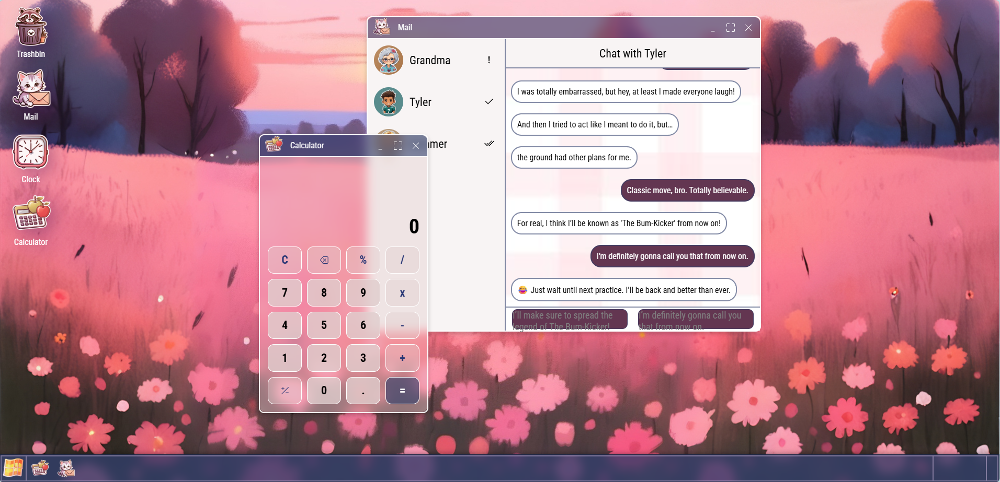

# 🖥️ Tiny Browser Workspace

A lightweight, browser-based Windows-like desktop simulation.  
Move icons on a grid, open and manage windows, and enjoy a working calculator app!  

---

## 📸 Screenshots

  

---

## 🛠 Technologies Used

- HTML, CSS, JavaScript  
- No backend — fully client-side  
- Deployed on GitHub Pages

---

## ✨ Features

- Drag & drop icons on a grid — no overlapping allowed  
- Open/close/minimize/maximize movable windows inside the browser  
- Active apps appear as icons on the taskbar  
- Fully functional calculator app  
- Pseudo chat app (work in progress)

---

## 🚀 How to Use

Simply open the [GitHub Pages link](https://roukorjerte.github.io/My-Tiny-Workspace/) and enjoy the desktop experience right in your browser!

---

## 🔮 Future Plans

- Improve pseudo chat with async functions and better UI  
- Add more apps like file explorer, notes, or calendar  
- Enhance drag & drop and window snapping features

---

## 💬 Feedback welcome!

I'm always happy to hear suggestions, feedback or ideas! You can [open an issue](https://github.com/roukorjerte/My-Tiny-Workspace/issues/new) or contact me directly.

---
